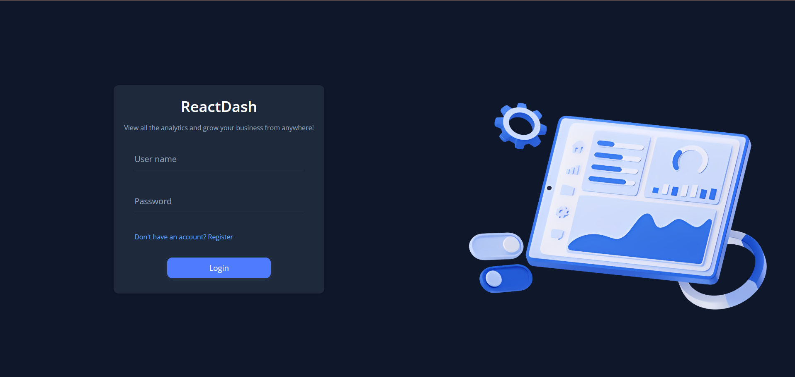
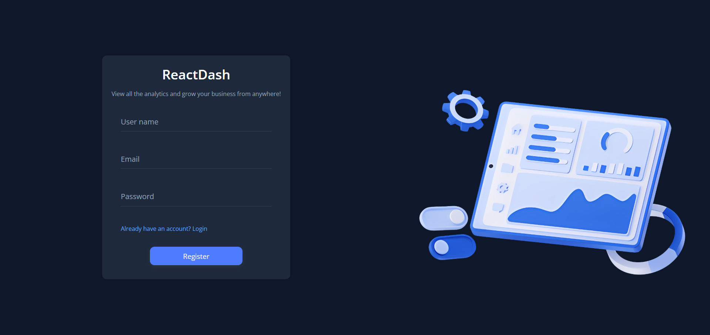
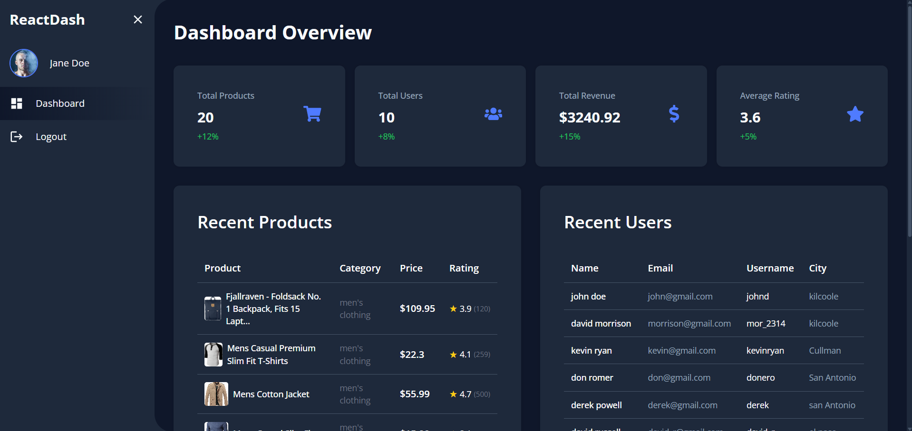

# React Development Challenge | Orthoplex Solutions Inc.

[](https://react-dash-psi.vercel.app/login)

**Live Site:** [https://react-dash-psi.vercel.app/login](https://react-dash-psi.vercel.app/login)

This project is a solution to the Orthoplex Solutions Inc. React Development Challenge. It demonstrates a modern, responsive dashboard application built with **React**, **TypeScript**, and **Vite**.

---

## Demo Credentials

> **This app uses a public fake API for demonstration. No real registration or data persistence occurs.**

**Use the following credentials to log in:**

- **Username:** `mor_2314`
- **Password:** `83r5^_`

---

## Features & Implementation

- **Login Page**: Validates input, uses fake API for authentication, redirects to dashboard on success.
- **Dashboard Page**: Fetches and displays product/user data from [Fake Store API](https://fakestoreapi.com/).
- **Navbar**: Responsive, allows navigation, and shows/hides based on authentication and screen size.
- **Protected Routes**: Only authenticated users can access the dashboard.
- **Loader**: Consistent loading spinner shown during API requests and auth checks.
- **Responsive Design**: Uses CSS Grid and Flexbox for layout; mobile-friendly navbar.
- **Centralized Types**: All TypeScript interfaces/types are in `src/types`.
- **State Management**: Uses React Context for authentication state.
- **Logout**: Clears session and redirects to login (bonus).

---

## Screenshots

### Login Page



### Register Page



### Dashboard



---

## Getting Started

### Prerequisites

- [Node.js](https://nodejs.org/) (v16+ recommended)
- [npm](https://www.npmjs.com/)

### Installation

```bash
npm install
```

### Development

```bash
npm run dev
```

Open [http://localhost:5173](http://localhost:5173) in your browser.

### Build

```bash
npm run build
```

### Preview Production Build

```bash
npm run preview
```

---

## Project Structure

```
src/
  components/         # UI and dashboard components
  contexts/           # React context providers (e.g., Auth)
  hooks/              # Custom React hooks
  pages/              # Page-level components (Dashboard, Login, etc.)
  providers/          # Context provider wrappers
  routes/             # App routing and protected routes
  schemas/            # Zod schemas for form validation
  services/           # API service logic
  styles/             # Global and module CSS
  types/              # All TypeScript types and interfaces
  utils/              # Utility functions
```

---

## Notes

- **Fake API**: This app uses [Fake Store API](https://fakestoreapi.com/) for demonstration. No real registration or data persistence occurs.
- **Registration**: The registration page is present for UI demonstration only; it does not create real users.

---

## License

MIT
